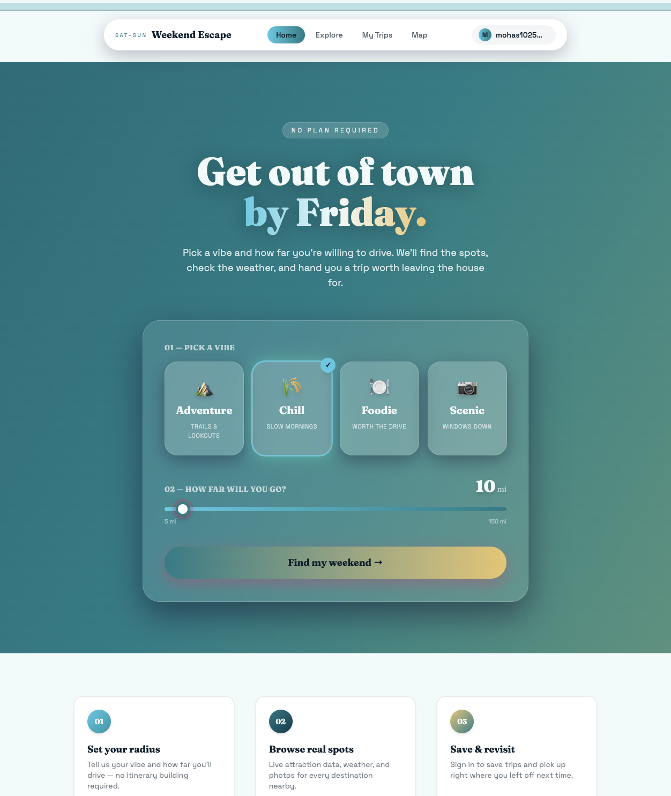
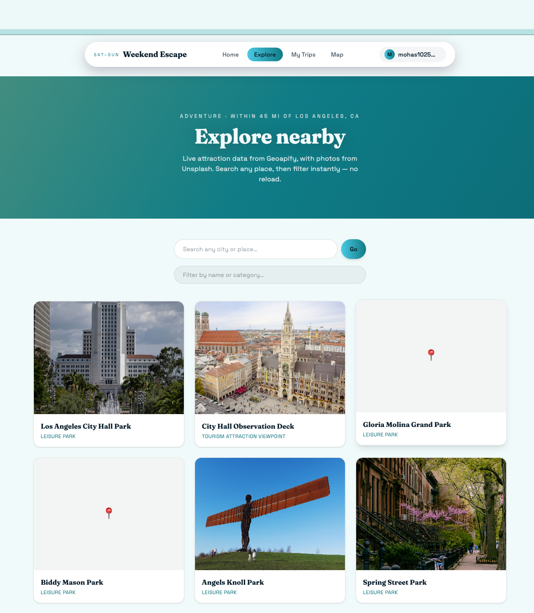
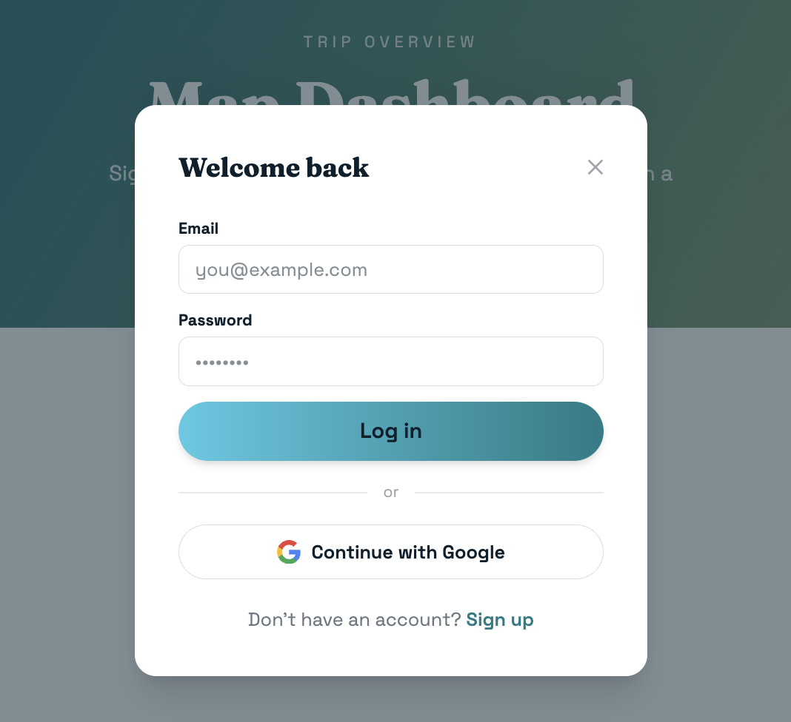
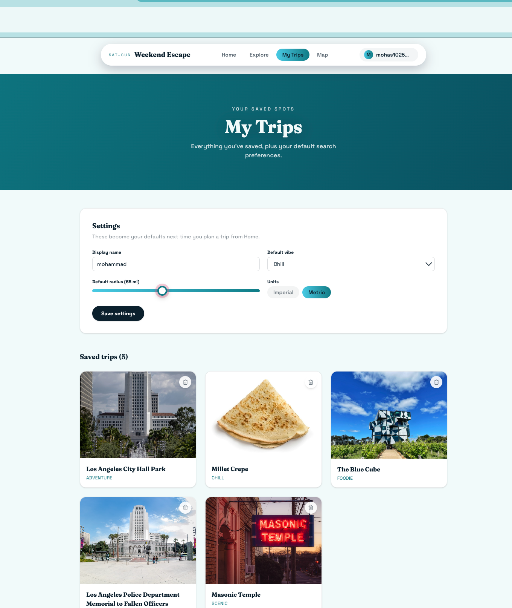
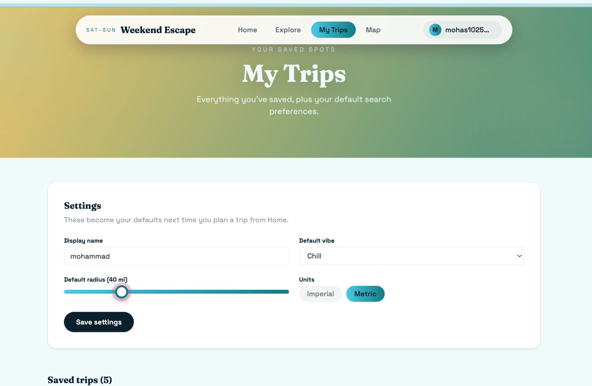
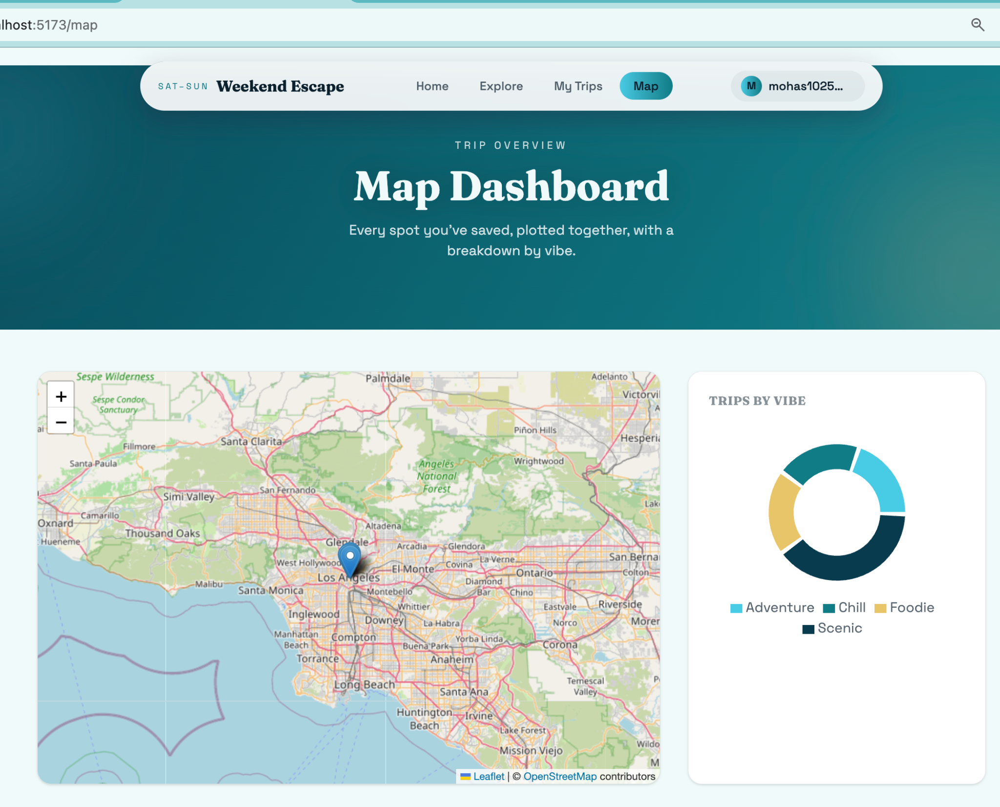

# Weekend Escape

A responsive travel-planning web app for spontaneous day trips. Pick a vibe
and a drive radius, browse real nearby attractions with live weather and
photos, save the ones you like, and see them plotted on a map with a
breakdown of your saved trips by vibe.

Built for **CPSC-349: Web Frontend Engineering**.

**Live site:** https://weekend-escape-12217.web.app
**GitHub repo:** https://github.com/mohas1025/weekend-escape

---

## Screenshots

**Home — pick a vibe and drive radius**


**Explore — live attraction search**


**Sign in / sign up**


**My Trips — saved trips + settings**


**Settings panel**


**Map Dashboard — saved trips on a map + vibe breakdown**


---

## Tech Stack

- **Frontend:** React (Vite) + Tailwind CSS — no component library like
  Bootstrap, so the design is fully custom
- **Routing:** React Router
- **Auth / Database:** Firebase Authentication (Email/Password + Google
  sign-in) + Cloud Firestore
- **Map:** Leaflet / React-Leaflet
- **Charts:** Recharts (Pie chart)
- **Deployment:** Firebase Hosting

## APIs Used

The app integrates 3 APIs, meeting the assignment's requirement of one
public keyless API, one private/authenticated API, and one additional API:

| API                                                     | Type                                                              | Purpose                                                                                                                                                                 |
| ------------------------------------------------------- | ----------------------------------------------------------------- | ----------------------------------------------------------------------------------------------------------------------------------------------------------------------- |
| [Open-Meteo](https://open-meteo.com)                    | **Public, keyless** — no API key or auth required                 | Returns live current weather (temperature + conditions) for each attraction, shown on the Attraction Detail page                                                        |
| [Geoapify Places + Geocoding](https://www.geoapify.com) | **Private, authenticated** — requires an API key on every request | Powers the core Explore search: returns real nearby attractions filtered by category and radius, plus geocodes any city/place the user types into a location search bar |
| [Unsplash](https://unsplash.com/developers)             | **Private, authenticated** — requires an access key               | Returns a relevant photo for each attraction, shown on both the Explore cards and Attraction Detail page                                                                |

All API responses are parsed and rendered into styled cards, weather
summaries, and photos — never dumped as raw JSON.

## Routes / Pages (5 total)

| Route             | Purpose                                                                                               |
| ----------------- | ----------------------------------------------------------------------------------------------------- |
| `/`               | Home — pick a vibe (Adventure, Chill, Foodie, Scenic) and a drive radius                              |
| `/explore`        | Browse nearby attractions with live data, an instant name/category filter, and a location search bar  |
| `/attraction/:id` | Detail page for a selected attraction — photo, category, live weather, and a "Save to trip" button    |
| `/trips`          | My Trips — a signed-in user's saved trips, plus a personal settings panel                             |
| `/map`            | Map Dashboard — saved trips plotted on an interactive map, with a pie chart summarizing trips by vibe |

## Features

- **Vibe-driven search:** each vibe (Adventure/Chill/Foodie/Scenic) maps to
  a different set of Geoapify categories, so switching vibes genuinely
  changes what attractions come back, not just the label
- **Live location search:** type any city or place and the app geocodes it
  and re-searches around that new location
- **Instant filtering:** typing in the filter box narrows the already-loaded
  attraction list immediately, with no page reload
- **Distance-based sorting:** results are sorted nearest-to-farthest from
  the search location
- **Firebase Authentication:** users can sign up and log in with
  email/password or with a Google account, and log out from the navbar
- **Personalized settings:** signed-in users can save a display name,
  default vibe, default search radius, and preferred units — these
  automatically pre-fill the Home page picker on future visits
- **Save / remove trips:** any attraction can be saved to Firestore from
  its detail page, and removed later from My Trips — all scoped privately
  to the signed-in user
- **Map Dashboard:** all of a user's saved trips are plotted as pins on a
  Leaflet map, alongside a Recharts pie chart breaking down saved trips by
  vibe category
- **Fully responsive design:** built mobile-first with Tailwind CSS —
  every layout collapses to a single column on phones (tested at iPhone
  and Samsung widths), adjusts at tablet width for iPad, and expands to
  a multi-column layout on desktop

## Responsive Design

The interface was tested across desktop, tablet (iPad), and mobile
(iPhone and Samsung) breakpoints using Tailwind's `sm:` and `lg:` utility
prefixes throughout every page — grids, navigation, forms, and the vibe
picker all reflow cleanly at each size, with a dedicated mobile navigation
bar for small screens.

## Design

The interface uses a custom ocean-inspired color palette (deep teal,
navy, and gold) with a glassmorphic UI style — translucent, blurred
panels layered over an animated gradient hero on the Home page. The vibe
picker cards respond to cursor movement with a real-time 3D tilt effect
(perspective transforms based on mouse position), adding a tactile,
interactive feel to the trip-builder form beyond static hover states.

## User Authentication and Data Persistence

- Implemented with **Firebase Authentication**, supporting both
  email/password sign-up/login and Google sign-in
- User-specific state (display name, default vibe, radius, units) is
  stored per-user in **Firestore** under `users/{uid}`
- Saved trips are stored in a `users/{uid}/trips` subcollection, so each
  user only ever sees and manages their own saved data
- Firestore security rules restrict all reads/writes to the signed-in
  user's own documents

## Setup

1. Clone the repo and install dependencies:

```bash
   npm install
```

2. Copy `.env.example` to `.env` and fill in your own API keys (Geoapify,
   Unsplash, and your Firebase project config):

```bash
   cp .env.example .env
```

3. Run the dev server:

```bash
   npm run dev
```

## Deployment

Deployed on **Firebase Hosting**:

```bash
npm run build
firebase deploy
```

Live URL: https://weekend-escape-12217.web.app

## Testing Sign-In-Gated Features

Saving trips, My Trips, and the Map Dashboard all require being signed
in, since that data is private to each user. Sign up with any email
address, or use "Continue with Google," to test the full save/view/remove
flow.
